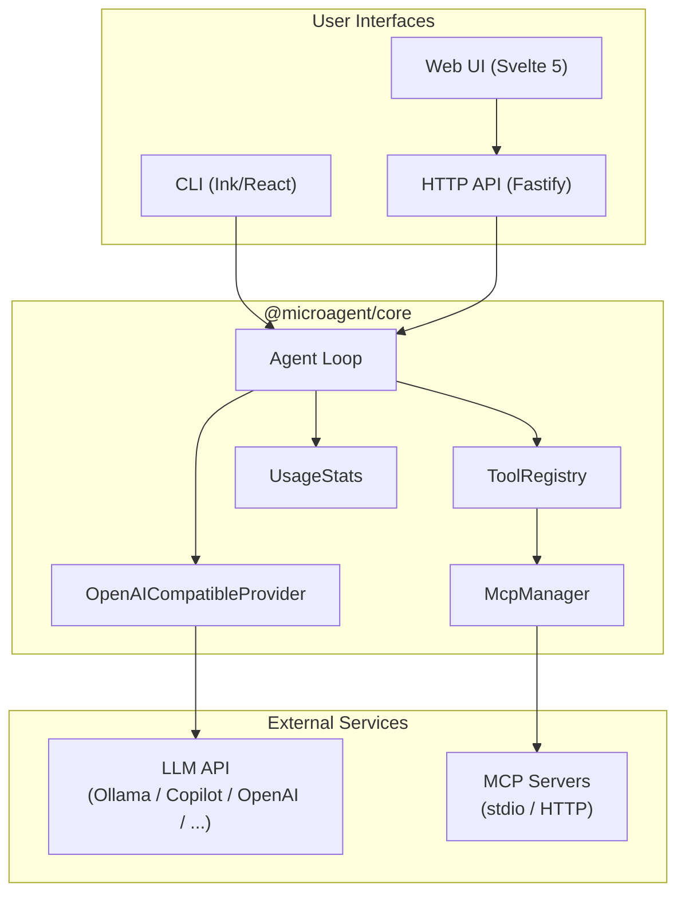
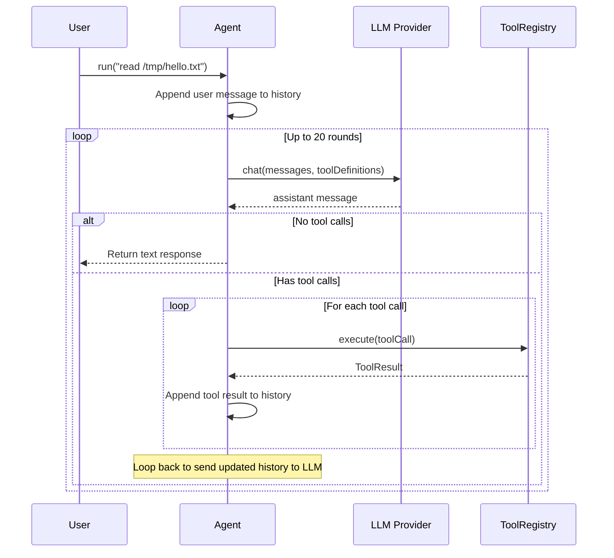
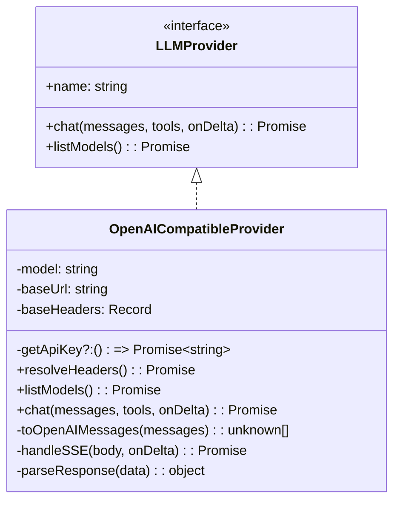
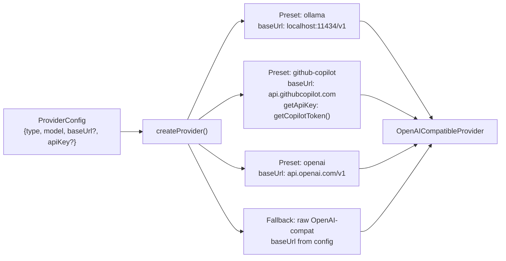
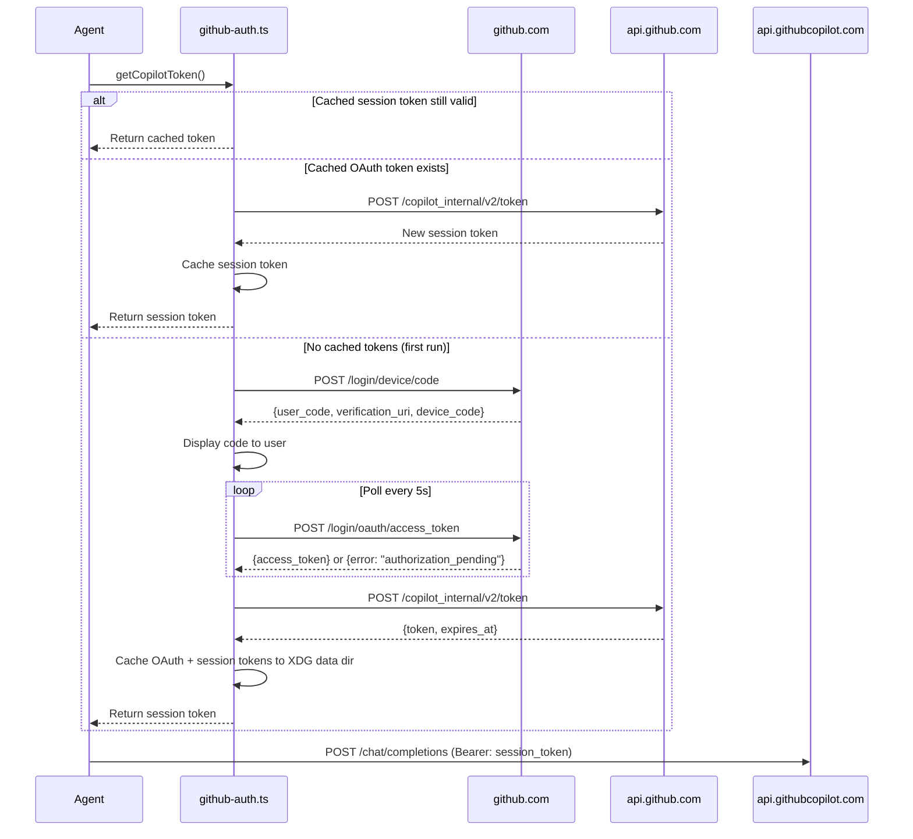
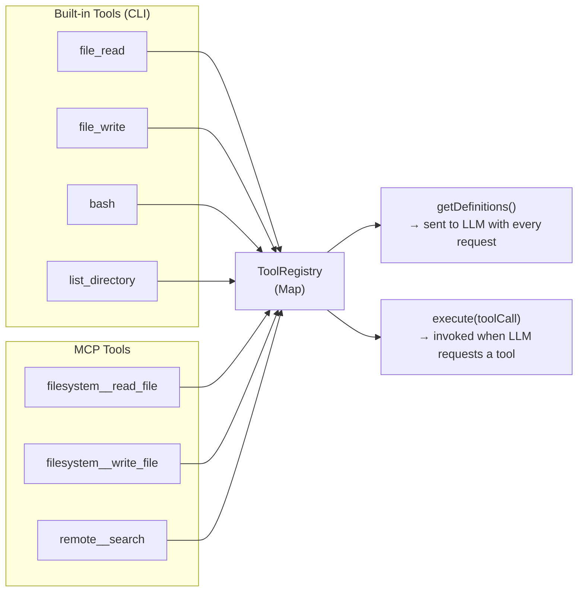
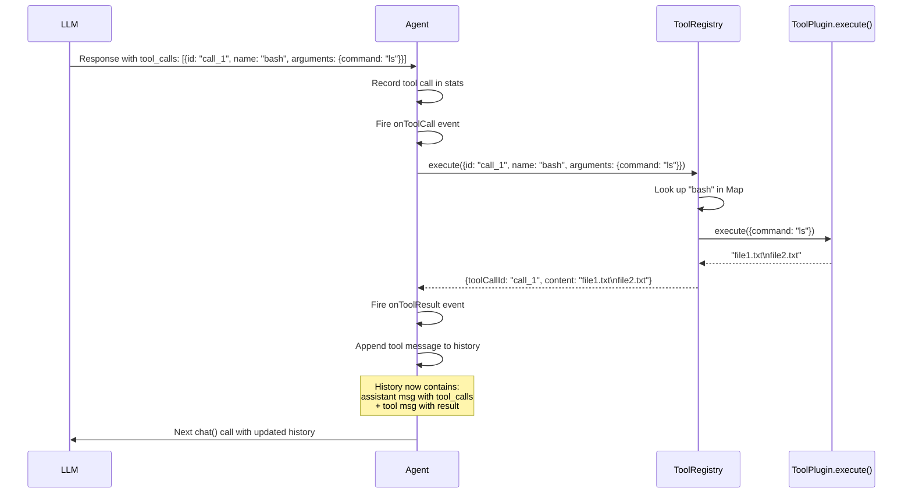
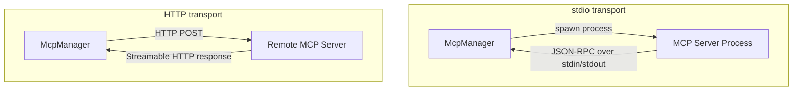
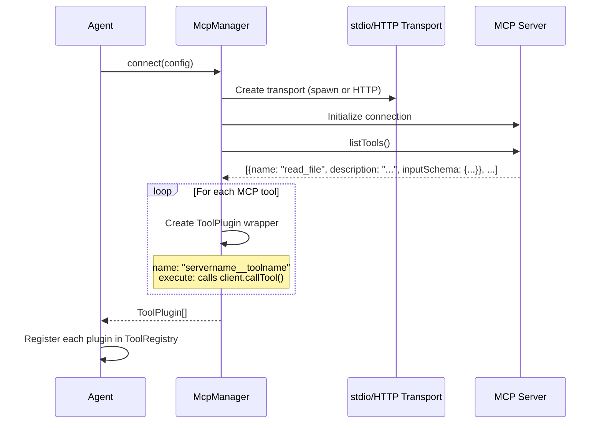
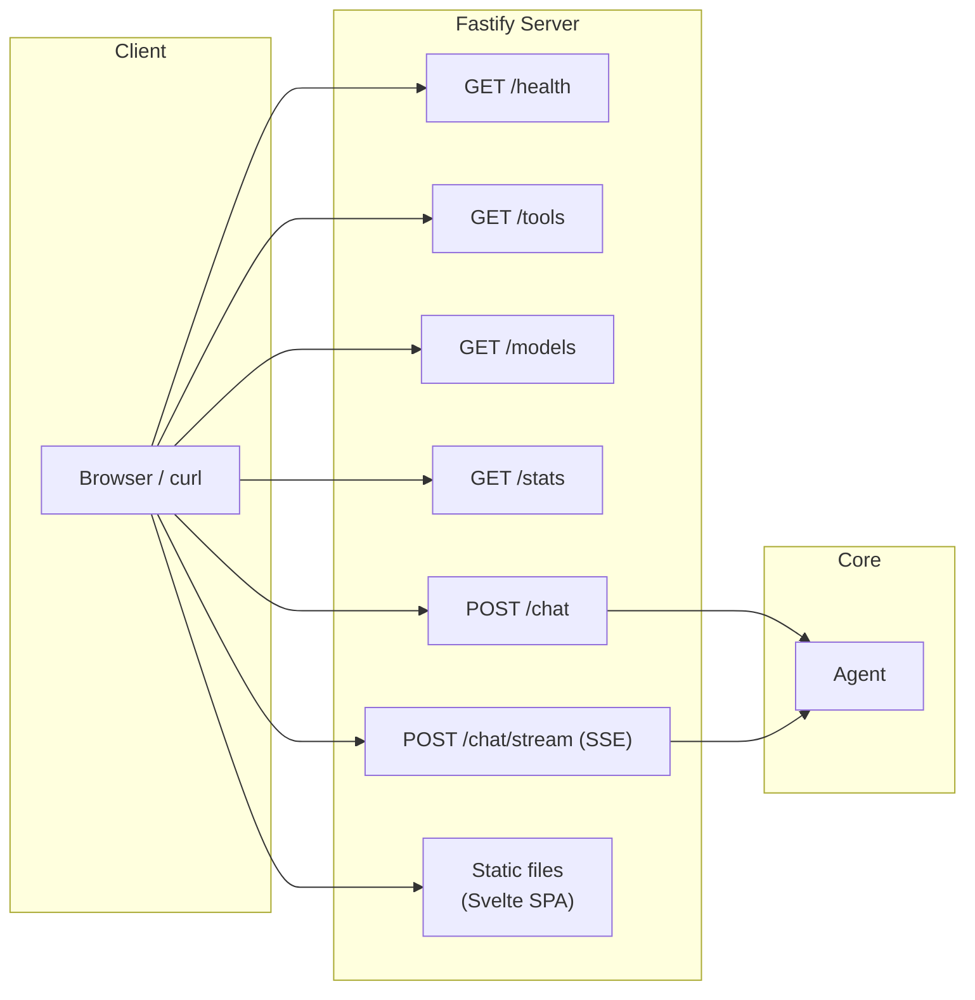

# How It Works

This document explains the internals of microagent — how LLM providers are abstracted, how tools are bound and invoked, how the agent loop drives a conversation, and how MCP servers integrate into the system.

## Table of Contents

- [High-Level Architecture](#high-level-architecture)
- [The Agent Loop](#the-agent-loop)
- [LLM Providers](#llm-providers)
  - [OpenAI Chat Completions Protocol](#openai-chat-completions-protocol)
  - [Unified Provider Architecture](#unified-provider-architecture)
  - [Provider Presets and Factory](#provider-presets-and-factory)
  - [Dynamic Authentication (GitHub Copilot)](#dynamic-authentication-github-copilot)
  - [Streaming (SSE)](#streaming-sse)
- [Tool System](#tool-system)
  - [ToolPlugin Interface](#toolplugin-interface)
  - [Tool Registry](#tool-registry)
  - [How Tools Are Sent to the LLM](#how-tools-are-sent-to-the-llm)
  - [Tool Call Execution Flow](#tool-call-execution-flow)
  - [Built-in Tools](#built-in-tools)
- [MCP Integration](#mcp-integration)
  - [What is MCP](#what-is-mcp)
  - [Transports: stdio vs HTTP](#transports-stdio-vs-http)
  - [How MCP Tools Become Plugins](#how-mcp-tools-become-plugins)
- [Message Protocol](#message-protocol)
  - [Message Roles](#message-roles)
  - [Conversation State](#conversation-state)
- [Configuration and Paths](#configuration-and-paths)
- [HTTP API and Web UI](#http-api-and-web-ui)

---

## High-Level Architecture



The system is a monorepo with four packages:

| Package | Role |
|---|---|
| `@microagent/core` | Agent loop, provider abstraction, tool registry, MCP client, usage stats |
| `@microagent/cli` | Terminal UI (Ink), CLI entry point (Commander), built-in tool plugins |
| `@microagent/server` | Fastify HTTP API with REST and SSE streaming endpoints |
| `@microagent/web` | Svelte 5 SPA that consumes the HTTP API |

`core` has zero knowledge of the UI layer. The CLI and server both instantiate an `Agent` from core and drive it through the same interface.

---

## The Agent Loop

The agent loop is the heart of microagent. It implements the standard LLM agent pattern: send messages to the model, check if the model wants to call tools, execute those tools, feed results back, and repeat until the model produces a final text response.



**Key implementation details** (`packages/core/src/agent.ts`):

1. The user message is appended to a persistent `messages[]` array (conversation state lives in memory for the session).
2. All registered tool definitions are sent with every LLM request — the model decides which (if any) to call.
3. Tool calls are executed sequentially. Each result is appended as a `tool` role message with the matching `toolCallId`.
4. The loop has a safety limit of **20 rounds** to prevent runaway tool-calling loops.
5. Events (`onDelta`, `onToolCall`, `onToolResult`) are fired throughout for UI updates.

---

## LLM Providers

### OpenAI Chat Completions Protocol

microagent uses a single protocol for all LLM communication: the **OpenAI Chat Completions API**. This is the de facto standard that virtually every LLM provider supports — either natively or through a compatibility layer.

The protocol works like this:

```
POST {baseUrl}/chat/completions
Content-Type: application/json
Authorization: Bearer {token}

{
  "model": "gpt-4o",
  "messages": [...],
  "tools": [...],          ← optional
  "stream": true/false
}
```

**Why this protocol?** Because it's universal. Ollama exposes it at `/v1/chat/completions`. GitHub Copilot exposes it at `api.githubcopilot.com/chat/completions`. OpenAI invented it. Groq, Together, LM Studio, vLLM, and dozens of others all implement it. One provider class handles them all.

### Unified Provider Architecture

Rather than having separate provider classes for each service, microagent has a single `OpenAICompatibleProvider` that handles all providers:



The provider is configured through `OpenAIProviderOptions`:

| Option | Purpose |
|---|---|
| `name` | Display name (e.g. "ollama", "github-copilot") |
| `model` | Model identifier sent in the request body |
| `baseUrl` | Base URL — `/chat/completions` and `/models` are appended to this |
| `apiKey` | Static API key, set once at construction |
| `getApiKey` | Dynamic token resolver, called before each request (for expiring tokens) |
| `headers` | Extra headers merged into every request |

The distinction between `apiKey` (static) and `getApiKey` (dynamic) is important. Most providers use a static key. GitHub Copilot uses a session token that expires and needs to be refreshed from a cached OAuth token — so it uses `getApiKey`.

### Provider Presets and Factory

The `createProvider()` factory maps provider type strings to pre-configured `OpenAIProviderOptions`:



The `type` field in `ProviderConfig` is a plain `string`, not a union. Any value that doesn't match a preset is treated as a custom OpenAI-compatible endpoint — you just need to supply `baseUrl` and optionally `apiKey`.

### Dynamic Authentication (GitHub Copilot)

GitHub Copilot does **not** accept personal access tokens or static API keys. It requires the **GitHub Device OAuth Flow**:



The OAuth token is long-lived and cached at `~/.local/share/microagent/github-copilot-token.json` (permissions `0o600`). Session tokens expire after ~30 minutes and are refreshed automatically using the cached OAuth token. The user only authenticates via browser once.

The `getApiKey` function in the github-copilot preset calls `getCopilotToken()`, which handles the entire flow transparently. The provider's `resolveHeaders()` method calls `getApiKey` before every request, ensuring the token is always fresh.

### Streaming (SSE)

When the caller provides an `onDelta` callback, the provider sets `stream: true` in the request and parses Server-Sent Events:

```
data: {"choices":[{"delta":{"content":"Hello"}}]}
data: {"choices":[{"delta":{"content":" world"}}]}
data: {"choices":[{"delta":{"tool_calls":[{"index":0,"id":"call_abc","function":{"name":"file_read"}}]}}]}
data: {"choices":[{"delta":{"tool_calls":[{"index":0,"function":{"arguments":"{\"path\":\"/tmp/test\"}"}}]}}]}
data: {"usage":{"prompt_tokens":50,"completion_tokens":12,"total_tokens":62}}
data: [DONE]
```

The SSE parser (`handleSSE`) reconstructs:
- **Text content** — concatenated from `delta.content` fragments, emitted as `{ type: "text" }` deltas
- **Tool calls** — assembled from streamed chunks indexed by `tool_calls[].index`, emitted as `tool_call_start` and `tool_call_end` deltas
- **Usage stats** — extracted from the final chunk (OpenAI `stream_options.include_usage` extension)

---

## Tool System

### ToolPlugin Interface

Every tool in microagent — whether built-in or discovered from an MCP server — implements the same interface:

```typescript
interface ToolPlugin {
  definition: ToolDefinition;
  execute(args: Record<string, unknown>): Promise<string>;
}

interface ToolDefinition {
  name: string;
  description: string;
  inputSchema: Record<string, unknown>; // JSON Schema
}
```

This is the only contract. A tool has a JSON Schema describing its inputs, and an `execute` function that takes those inputs and returns a string.

### Tool Registry

The `ToolRegistry` is a simple `Map<string, ToolPlugin>`:



Registration is first-come-first-served with a flat namespace. MCP tools are namespaced as `servername__toolname` to avoid collisions (e.g. `filesystem__read_file`).

### How Tools Are Sent to the LLM

When the agent calls `provider.chat()`, it passes all tool definitions. The provider converts them to the OpenAI tools format:

```
// Internal ToolDefinition
{
  name: "file_read",
  description: "Read the contents of a file at the given path",
  inputSchema: {
    type: "object",
    properties: { path: { type: "string" } },
    required: ["path"]
  }
}

// Sent to the LLM as:
{
  type: "function",
  function: {
    name: "file_read",
    description: "Read the contents of a file at the given path",
    parameters: {
      type: "object",
      properties: { path: { type: "string" } },
      required: ["path"]
    }
  }
}
```

The LLM sees the tool names, descriptions, and JSON Schema parameters. It decides whether to call tools based on the user's request and the tool descriptions. The model returns tool calls in its response, which the agent then executes.

### Tool Call Execution Flow



If a tool throws an error, the registry catches it and returns `{ isError: true, content: "Tool error: ..." }`. The error is sent back to the LLM as a tool result — the model can then decide how to handle it (retry, inform the user, try a different approach).

### Built-in Tools

The CLI package registers four built-in tools:

| Tool | File | What it does |
|---|---|---|
| `file_read` | `cli/src/tools/file-read.ts` | `readFile()` at given path |
| `file_write` | `cli/src/tools/file-write.ts` | `writeFile()` with automatic `mkdir -p` |
| `bash` | `cli/src/tools/bash.ts` | `child_process.exec()` with timeout |
| `list_directory` | `cli/src/tools/list-dir.ts` | `readdir()` with file type annotation |

Each is a plain object implementing `ToolPlugin` — no base class, no inheritance. They're registered in `cli/src/tools/index.ts`:

```typescript
export function registerBuiltinTools(registry: ToolRegistry): void {
  registry.register(fileReadTool);
  registry.register(fileWriteTool);
  registry.register(bashTool);
  registry.register(listDirTool);
}
```

---

## MCP Integration

### What is MCP

The [Model Context Protocol](https://modelcontextprotocol.io) (MCP) is an open standard for connecting LLMs to external tools and data sources. Instead of hardcoding every tool, an MCP server advertises its capabilities at runtime, and the client (microagent) discovers and registers them dynamically.

### Transports: stdio vs HTTP

MCP supports two transport mechanisms:



| Transport | When to use | How it works |
|---|---|---|
| **stdio** | Local tools (filesystem, git, etc.) | microagent spawns the server as a child process. Communication happens over stdin/stdout using JSON-RPC. |
| **HTTP** | Remote services, shared servers | microagent connects to an HTTP endpoint. Uses the Streamable HTTP transport from the MCP SDK. |

stdio is the default and preferred transport — it's simpler, faster, and doesn't require a running server.

### How MCP Tools Become Plugins

The `McpManager` handles the full lifecycle:



The key transformation happens in `McpManager.connect()`:

1. Connect to the MCP server via the appropriate transport
2. Call `client.listTools()` to discover available tools
3. For each tool, create a `ToolPlugin` wrapper:
   - **Name** is prefixed: `${serverName}__${toolName}` (e.g. `filesystem__read_file`)
   - **Definition** uses the tool's JSON Schema directly
   - **Execute** calls `client.callTool()` on the MCP client, translating the response back to a string

From the ToolRegistry's perspective, MCP tools are identical to built-in tools. The LLM doesn't know the difference — it just sees tool names and schemas.

---

## Message Protocol

### Message Roles

microagent uses four message roles, matching the OpenAI protocol:

| Role | Purpose | Example |
|---|---|---|
| `system` | Sets the agent's behavior | "You are a helpful coding assistant." |
| `user` | User input | "What files are in /tmp?" |
| `assistant` | Model response (may include tool calls) | "Let me check that for you." + tool_calls |
| `tool` | Result of a tool execution | "file1.txt\nfile2.txt" |

### Conversation State

Messages accumulate in the agent's `messages[]` array throughout the session. A typical multi-turn conversation with tool use looks like:

```
messages[0]: system  → "You are a helpful coding assistant."
messages[1]: user    → "What files are in /tmp?"
messages[2]: assistant → "" + toolCalls: [{name: "list_directory", args: {path: "/tmp"}}]
messages[3]: tool    → "file1.txt\nfile2.txt\ndir1/" (toolCallId matches)
messages[4]: assistant → "The /tmp directory contains: file1.txt, file2.txt, and dir1/"
messages[5]: user    → "Read file1.txt"
messages[6]: assistant → "" + toolCalls: [{name: "file_read", args: {path: "/tmp/file1.txt"}}]
messages[7]: tool    → "Hello, world!"
messages[8]: assistant → "The file contains: Hello, world!"
```

The full history is sent with every LLM request. This gives the model context about previous tool results and conversation flow. There is no message pruning or summarization — the session is ephemeral and resets when the process exits.

---

## Configuration and Paths

### XDG Base Directory Specification

microagent follows [XDG conventions](https://specifications.freedesktop.org/basedir-spec/latest/) for file storage:

| Purpose | Default path | Environment override |
|---|---|---|
| Config | `~/.config/microagent/config.json` | `XDG_CONFIG_HOME` |
| Data (tokens) | `~/.local/share/microagent/` | `XDG_DATA_HOME` |
| Cache | `~/.cache/microagent/` | `XDG_CACHE_HOME` |

### Config Resolution Order

When loading configuration, the CLI checks in order:

1. Explicit `--config <path>` flag
2. XDG config file (`~/.config/microagent/config.json`)
3. Local `microagent.config.json` in the current directory
4. CLI flags (`--provider`, `--model`, etc.)

### Config File Format

```json
{
  "provider": {
    "type": "github-copilot",
    "model": "gpt-4o"
  },
  "systemPrompt": "You are a helpful coding assistant.",
  "mcpServers": [
    {
      "name": "filesystem",
      "transport": "stdio",
      "command": "npx",
      "args": ["-y", "@modelcontextprotocol/server-filesystem", "/tmp"]
    }
  ]
}
```

---

## HTTP API and Web UI

The server package wraps the agent in Fastify routes:



### Streaming Endpoint

`POST /chat/stream` uses Server-Sent Events to push real-time updates to the client:

```
event: delta
data: {"type":"text","text":"Let me "}

event: delta
data: {"type":"text","text":"check that."}

event: tool_call
data: {"name":"file_read","args":{"path":"/tmp/test"}}

event: tool_result
data: {"name":"file_read","content":"Hello, world!"}

event: delta
data: {"type":"text","text":"The file contains: Hello, world!"}

event: complete
data: {"response":"The file contains: Hello, world!","stats":{...}}
```

The Svelte web UI (`@microagent/web`) consumes this SSE stream via a `fetchEventSource` client in `lib/api.ts`, rendering text as it arrives and showing tool calls in an expandable panel.
